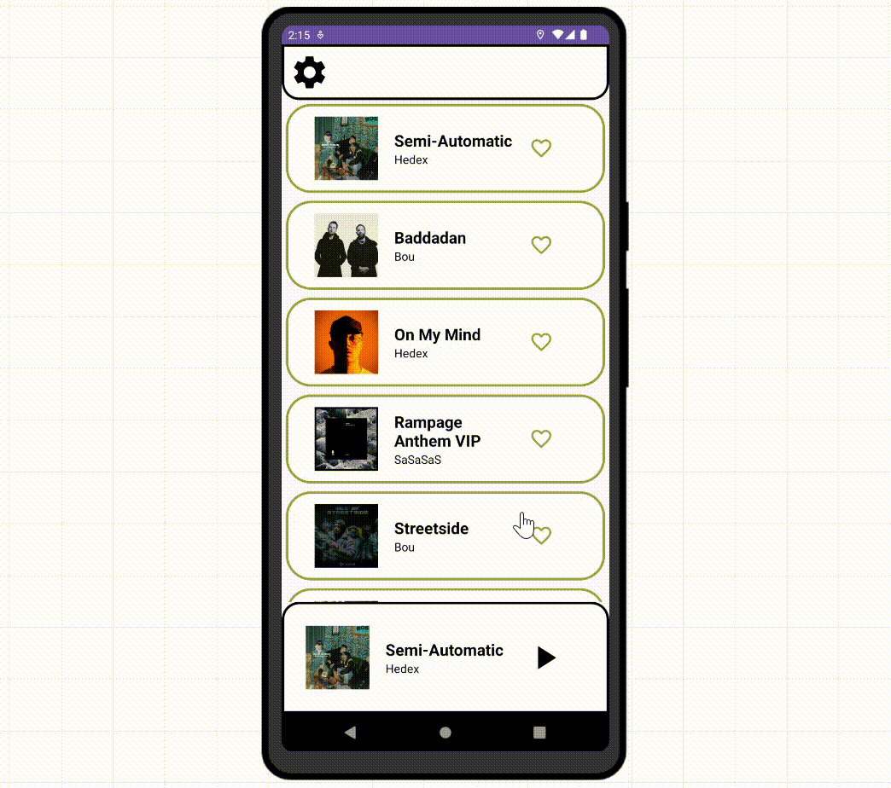
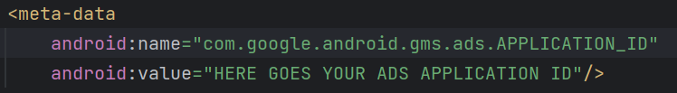
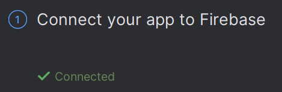

# Music Player App

<a href="https://appetize.io/app/2va72f4rcuub446rz5mn22ve6m?device=pixel7pro&osVersion=13.0"></a>

## Overview

Project made in collaboration with [August Pratt](https://github.com/jpratt21). We wanted to create a music player app that controls the volume of the device with the speed of the user. 

This is an Android Studio Project developed in Kotlin, using a wide range of technologies such as Google Firebase, GPS location or Google Ads.   

[](https://appetize.io/app/2va72f4rcuub446rz5mn22ve6m?device=pixel7pro&osVersion=13.0)

## Technologies Used

[](https://developer.android.com/)
[](https://kotlinlang.org/)
[](https://firebase.google.com/)
[]()
[](https://ads.google.com/)


## Requirements

For this project you will need a Google Ads ID credential which you can create and use [here](https://apps.admob.com/).



Furthermore, you will have to create and use your own Firebase database, importing your google-services.json or linking your project to Firebase in Android Studio. You will find more info [here](https://firebase.google.com/docs/android/setup).



## Project

This is the general structure of the project.

<ul>
  <li>
    Inside ./app/src/main/java/com/example/music_player/
    <br>
    <br>
    <ul>
      <li><b>MainActivity.kt</b>: Activity for the home page. Links the views from the xml with the functinallities of the app.</li>
      <li><b>MusicActivity.kt</b>: Activity for the current song page. Links the views from the xml with the functinallities of the app.</li>
      <li><b>SettingsActivity.kt</b>: Activity for the settings page. Links the views from the xml with the functinallities of the app.</li>
      <li><b>GPSSpeed.kt</b>: Model for the speed tracking using the GPS from the device.</li>
      <li><b>PlayerManager.kt</b>: Manager for the ExoPlayer. Useful for using the same media3 player in the whole app.</li>
      <li><b>Song.kt</b>: Model for each song.</li>
      <li><b>Songs.kt</b>: Model for a group of songs (ArrayList).</li>
      <li><b>SongAdapter.kt</b>: Adapter for the recycler view in the home page. Retrieves all the songs and adds the necessary funcionallity.</li>
    </ul>
  </li>
  <li>
    Inside ./app/src/main/res/
    <br>
    <br>
    <ul>
      <li><b>drawable</b>: folder in which all the images/icons are stored.</li>
      <li><b>layout</b>: all the xml files necessary for the views of the app.</li>
      <li><b>transition</b>: all the xml files used for the transitions between layouts.</li>
      <li><b>values</b>: inside, there are folders for the strings, colors and themes used in the app.</li>
    </ul>
  </li>
  <li>
    Inside ./app/src/main/
    <br>
    <br>
    <ul>
      <li><b>AndroidManifest.xml</b>: Stores the necessary permissions for the app to run. Also, all the activities are declared in this file.</li>
    </ul>
  </li>
</ul>


## Installation

1. `Fork` this repository.
   
2. Clone this repository in your Android Studio projects folder.
```bash 
git clone https://github.com/<USERNAME>/adeviento-web.git
```

3. Open the MusicPlayerApp with Android Studio.

4. Add your own Firebase database (google-services.json) and credentials for Google Ads (in AndroidManifest.xml). 

5. Run the project in an emulator or an actual android physical device.

## License

[](LICENSE)
